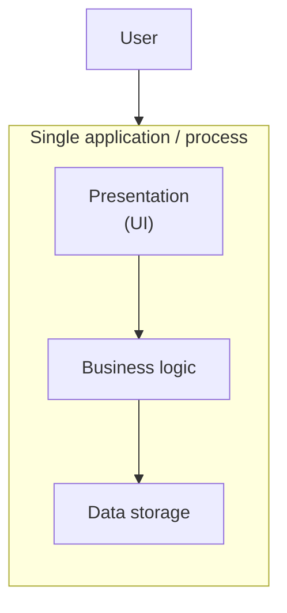

# One-tier architecture

Everything — the user interface, the business logic, and the data storage —
runs together as a single unit, usually on a single machine or in a single
process. There is no network boundary between layers.

**Characteristics**

- Simplest to build and deploy — one artifact, one runtime.
- No network calls between layers, so it's fast and has no partial-failure
  modes between tiers.
- Cannot scale the UI, logic, and data independently, and a crash in one
  part takes down the whole application.
- Typical examples: a standalone desktop app with an embedded database, or
  a simple script that reads/writes its own local file.
