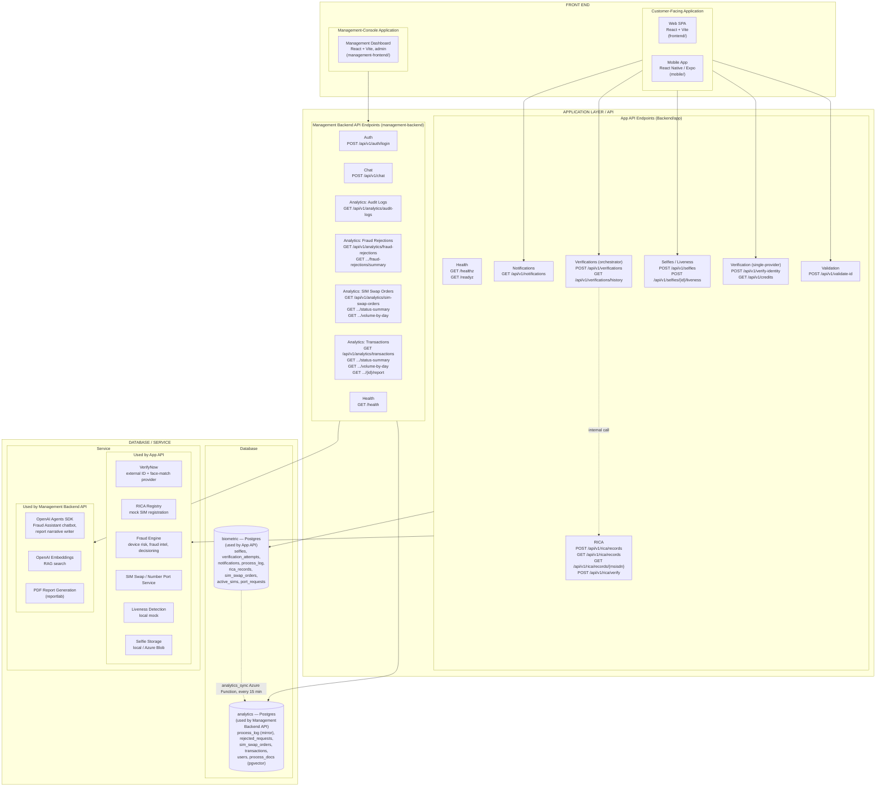

# Project architecture overview

High-level view of how this project's front end, API layer, and
database/service layer fit together, based on what is actually wired up in
the code today (not unmounted/dead routes, and not the superseded
`Backend/analytics_api`).

## Arrow granularity — assessment

Arrows are drawn at **mixed granularity**, not uniformly at the big-block or
subblock level:

- **Front End → API layer**: drawn at the feature-group level, not just
  block-to-block. This matters because the relationship isn't uniform — the
  customer-facing apps never call RICA (it's an internal-only call made by
  the verifications orchestrator), and the management dashboard never calls
  the App API at all. A single "Front End → API layer" arrow would hide
  exactly the separation this diagram exists to show.
- **API layer → Database/Service layer**: drawn at the subblock level.
  Nearly every feature area within each API touches its own API's database
  and services, so per-endpoint arrows here would add clutter without adding
  information.
- **Database → Database**: one explicit labeled arrow for the
  `analytics_sync` Azure Function, since that's a distinct, real data flow
  (a 15-minute mirror job) worth calling out on its own.

## Notes

- `health` (`/healthz`, `/readyz`) and `mgmtHealth` (`/health`) are infra
  liveness/readiness probes, not endpoints either front end calls — that's
  why they have no incoming arrows from the Front End block.
- `Backend/app/routers/iccid.py` and a duplicate `sim_swap.py` router exist
  in the codebase but are **not mounted** in `Backend/app/main.py`, so they
  are excluded here as dead code.
- `Backend/analytics_api` is excluded: it has no Dockerfile reference
  anywhere in the repo, and `management-console/management-backend`'s own
  code comments state it intentionally duplicates and supersedes it.
- See [`three-tier-architecture.md`](three-tier-architecture.md) for the
  general pattern this project follows: Front End (presentation) →
  Application Layer / API (logic) → Database/Service (data).
