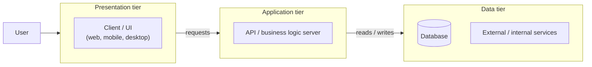

# Three-tier architecture

The application is split into three independent layers, each with a single
responsibility: **presentation**, **application logic**, and **data**. Each
layer only talks to its immediate neighbor.

**Characteristics**

- Each tier can be developed, deployed, and scaled independently — e.g. the
  API server can scale out without touching the client or the database.
- The client never touches the database directly; all access goes through
  the application tier, which is the single place business rules and
  validation live.
- Multiple different clients (web, mobile, admin console) can share the same
  application tier and its rules, instead of each reimplementing them.
- Adds network hops and moving parts compared to one- or two-tier setups,
  but is the standard shape for systems that need multiple client types and
  a controlled, auditable point of access to data.
- This is the pattern this project follows — see
  `project-architecture-overview.md` for how it's applied here.
