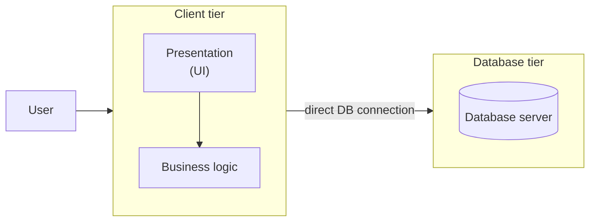

# Two-tier architecture

The application is split across a network boundary: a **client tier** that
owns both the presentation and the business logic, talking directly to a
**database tier**. This is the classic "client-server" model.

**Characteristics**

- The client talks to the database directly — there's no intermediary API
  layer enforcing or centralizing business rules.
- Easier to build than a full multi-tier system, but every client (desktop
  app, second UI, script) that wants to reuse the logic must reimplement it,
  since the logic lives inside the client, not behind a shared API.
- The database is exposed to every client directly, which widens the attack
  surface and makes schema changes riskier to roll out.
- Typical examples: a desktop app connecting straight to a SQL database, or
  early web apps where the web server embeds both UI rendering and business
  rules and queries the database itself.
