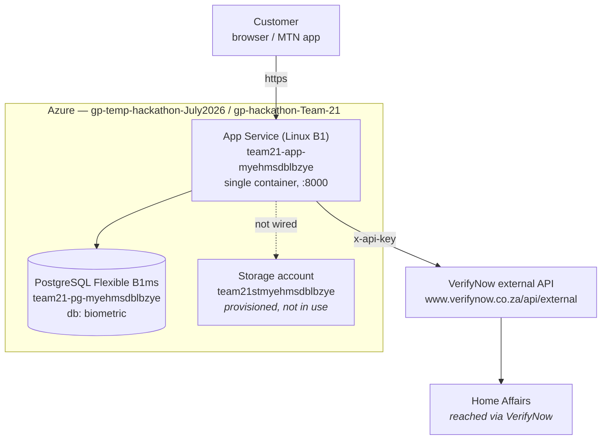
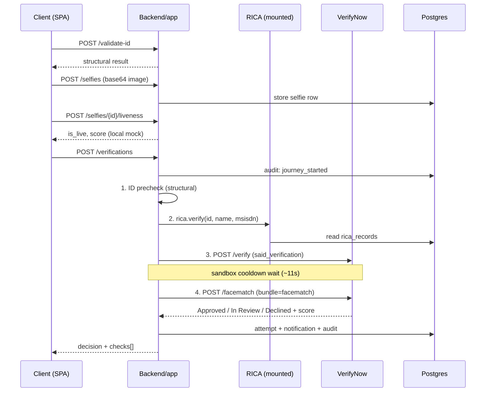

# Application architecture — as deployed

What actually runs today, verified against the deployed environment on
2026-07-29.

This is deliberately **not** the CARB target design. That is described in the
infrastructure repository (`facial_biometric_iac/docs/architecture.md`) and
assumes APIM, Container Apps, private endpoints and Azure AI Face — none of
which exist in the hackathon subscription. Where the two differ, this document
is the one describing reality; the differences are listed at the end.

---

## System context

One container serves both the React SPA and the FastAPI API on port 8000. There
is no gateway, no APIM and no private networking — the App Service public
hostname is the only ingress, and egress to VerifyNow is straight out over the
internet.

---

## Application structure

The repository holds four FastAPI applications. Only one is deployed; the
others are either mounted into it or not reachable at all.

| Package | What it is | In the deployed app? |
|---|---|---|
| `Backend/app` | The journey API and SPA host | **Yes** — this is the deployed app |
| `Backend/rica_service` | Mock RICA registry | **Yes** — mounted as a router |
| `Backend/external_backend` | VerifyNow client (not an app) | **Yes** — imported |
| `Backend/internal_backend` | ID validation helpers, plus a separate audit app | Partly — validation is imported; `audit_api.py` is **not** mounted |

**RICA is mounted rather than deployed separately.** It ships with its own
`Dockerfile` and runs standalone, but the infrastructure deploys a single
container, so a second port would have nowhere to route. `main.py` therefore
exposes an `APIRouter` that both its own `app` and `Backend/app/main.py`
include. Running it standalone still works and its Dockerfile healthcheck is
unchanged.

**`internal_backend/audit_api.py` is dead in this deployment.** It declares its
own `FastAPI()` rather than a router, needs `psycopg2` (the app uses psycopg 3)
and `postgres_*` environment variables that are not set, and inserts into a
`process_log` table it never creates. Auditing is instead done by
`Backend/app/services/audit.py`, which writes the same table over the
application's existing connection.

### Not in the deployed app

These exist only in open pull requests and are unreachable today:

| Service | PR | Journey step it would provide |
|---|---|---|
| `sim_swap_service` | #21, #22 | Creating and activating the SIM swap |
| `fraud_engine` | #20 | Device risk, fraud intelligence, decisioning |
| OCR document fallback | #19 | Fallback when Home Affairs is unavailable |

Each brings its own `Dockerfile`. Merging them will force the same choice RICA
already faced: mount as routers, or move to multi-container deployment.

---

## The verification journey

`POST /api/v1/verifications` runs the whole chain server-side and returns both
the decision and a per-step `checks` array.

Order and gating:

1. **ID precheck** — structural and Luhn validation, no external call. Fail
   ends the journey.
2. **Liveness** — a stored selfie must already have passed. Fail ends the
   journey.
3. **RICA registration** — does the claimed name own the number being swapped?
   A mismatch is the fraud case this journey exists to stop, so it ends the
   journey **before any provider call** and therefore costs nothing. Skipped
   (not failed) when the caller supplies no name and number.
4. **ID verification** — VerifyNow `said_verification`. A provider failure here
   is not fatal; the face match is the stronger signal and still runs.
5. **Home Affairs face match** — VerifyNow `/facematch`, `bundle=facematch`,
   comparing the stored selfie against the ID photo Home Affairs holds.

### Outcomes

The provider answers `Approved`, `In Review` or `Declined`, so there are three
outcomes — not two:

| Provider status | Outcome | Notification |
|---|---|---|
| `Approved`, score ≥ `FACE_MATCH_MIN_SCORE` | `approved` | approval |
| `Approved`, score below threshold | `review` | review |
| `In Review` | `review` | review |
| `Declined` | `rejected` | rejection |
| Provider unreachable | `approved` via **fallback**, flagged for manual review (HT2-15) | approval |

`review` is a first-class status through the decision, the database, the
notification and the history filter. An *In Review* customer is neither
approved nor turned away and must not be shown either.

---

## Data

One PostgreSQL database, `biometric`, holds everything. Five tables, all created
at startup:

| Table | Written by | Contents |
|---|---|---|
| `selfies` | `app/repository.py` | Selfie reference, content type, liveness status/score/provider |
| `verification_attempts` | `app/repository.py` | One row per decision: status, method, reason, provider status |
| `notifications` | `app/services/notifications.py` | Customer-facing inbox messages |
| `process_log` | `app/services/audit.py` | Audit trail — one row per journey step |
| `rica_records` | `rica_service/store.py` | Mock SIM registrations |

**Selfie images are not in the database.** Only a reference is stored. The bytes
go to `SELFIE_STORAGE_DIR` on the App Service `/home` share, because
`AZURE_STORAGE_CONNECTION_STRING` is unset — see gaps below.

**The audit trail never stores biometric payloads.** `services/audit.py`
redacts `image`, `selfie_image_base64`, `reference_image_base64` and `raw`
before writing, per CARB slide 20. An audit failure is logged and swallowed so
it can never break a customer journey.

---

## External provider

Base URL `https://www.verifynow.co.za/api/external`, authenticated with
`x-api-key`.

| Endpoint | Used for | Wired? |
|---|---|---|
| `POST /facematch` | Home Affairs face match | Yes |
| `POST /verify` | `said_verification` ID check | Yes |
| `GET /my_credits` | Credit balance | Yes (`/api/v1/credits`) |
| `POST /passive-liveness` | Real liveness | Client written, **not wired** |

### Sandbox and credits

`VERIFY_MODE` controls the call mode. It resolves to `production` **only** on
that exact string — any typo, empty value or missing variable falls back to
sandbox, so a misconfiguration cannot spend credits. The request body cannot
choose the mode: it is a deployment decision, not a client one.

Sandbox returns mock responses and consumes no credits. The mock varies by ID
number, which is what makes both the approval and review paths demonstrable.

### The 10-second cooldown

The sandbox rate-limits **per IP across all its routes**. Two provider calls in
one journey therefore need a wait between them, controlled by
`SANDBOX_COOLDOWN_SECONDS` (default 11). This is why:

- a successful journey takes **~15s** in sandbox, and the SPA shows a progress
  screen rather than a button spinner;
- `passive-liveness` is **not** wired in — using it *and* face match in one
  journey would trip the limit. Liveness stays local and instant.

Production has no such limit; the same journey would be ~2-3s.

---

## Configuration

Read from App Service application settings. "Set" below means explicitly
configured on the deployed app; the rest run on their code defaults.

| Setting | Purpose | Set? |
|---|---|---|
| `DATABASE_URL` | Postgres connection (requires `psycopg`; no SQLite fallback once set) | Yes |
| `VERIFY_NOW_API_KEY`, `VERIFY_BASE_URL` | Provider credentials | Yes |
| `Idempotency_id_key` | Sent for production POSTs only | Yes |
| `VERIFY_MODE` | `sandbox` (default) or `production` | Yes — `sandbox` |
| `FACE_MATCH_MIN_SCORE` | Approval floor, 0-100 | Yes — `60` |
| `ENVIRONMENT` | Written into every audit row | Yes |
| `STATIC_DIR`, `WEBSITES_PORT`, `ENABLE_DOCS`, `LOG_LEVEL` | Hosting | Yes |
| `SANDBOX_COOLDOWN_SECONDS` | Wait between provider calls | No — default `11` |
| `LIVENESS_PROVIDER`, `LIVENESS_MIN_SCORE` | Liveness selection and threshold | No — default `mock`, `0.6` |
| `SELFIE_STORAGE_DIR` | Local selfie directory | No — default `data/selfies` |
| `AZURE_STORAGE_CONNECTION_STRING`, `AZURE_STORAGE_CONTAINER` | Blob selfie storage | No — blob is unused |

`POSTGRES_HOST`, `POSTGRES_DB`, `POSTGRES_USER`, `POSTGRES_PASSWORD` and
`STORAGE_ACCOUNT` are also set on the App Service but **no code reads them** —
leftovers from an earlier revision of the template. They are safe to remove.

---

## Gaps against the CARB target

Honest differences between this deployment and the approved design. These are
in addition to the five recorded in the infrastructure repository's
`carb-deviations.md`.

| Area | CARB target | Today |
|---|---|---|
| Biometric provider | Azure AI Face | **VerifyNow** — Cognitive Services is unregistered and Face is behind Limited Access review |
| Liveness | Azure AI Face liveness | Local heuristic (`mock`). VerifyNow passive liveness is available but blocked by the cooldown |
| Compute | Container Apps behind APIM | App Service, no gateway |
| Network | Private endpoints, no public IPs | Public App Service hostname; Postgres reachable from the internet |
| Selfie storage | Blob with a 7-day lifecycle policy | App Service `/home` share, **no retention policy** |
| Secrets | Key Vault references | App Service application settings |
| Identity | Managed identity | API key in configuration |

Two of these deserve attention beyond the hackathon:

**Selfie retention.** The CARB requires raw biometric images be removed after
verification, and the infrastructure doc describes a blob lifecycle policy
enforcing that. Nothing enforces it today — images persist on the app's file
share indefinitely. Wiring `AZURE_STORAGE_CONNECTION_STRING` to the storage
account that already exists would close this.

**Postgres exposure.** A firewall rule permits `0.0.0.0–255.255.255.255` so the
team can reach the database directly. That is a demo convenience and should be
removed afterwards.
